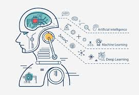

# Как данные превращаются в «пищу» для алгоритма: шаги и примеры  



Предварительные знания: Статья 1 — «Машинное обучение: от данных к предсказаниям».

## 1. **Сбор данных: первоначальный источник**  
Машинное обучение начинается с сбора данных. Данные могут быть:  
- **Структурированными** (например, таблицы в Excel или базах данных).  
- **Неструктурированными** (текст, изображения, аудио, видео).  

**Примеры источников:**  
- Сайты интернета (для текста/изображений).  
- Базы данных (например, продажи товаров в магазине).  
- Датчики IoT (температура, влажность).  

**Важно:** Неверные или неполные данные могут привести к неэффективной модели.  

---

## 2. **Предобработка данных: очистка и подготовка**  
Перед использованием данные требуют очистки:  

### a) **Обработка пропусков**  
Удаление или заполнение отсутствующих значений (например, средним, медианой или предсказанием).  

**Пример:**  
Если в таблице с клиентами есть пропущенные значения в колонке "возраст", их можно заполнить средним возрастом.  

### b) **Удаление дубликатов**  
Повторяющиеся записи могут искажать результаты.  

### c) **Обработка категориальных переменных**  
Некоторые алгоритмы не работают с текстом (например, "мужской", "женский"). Их нужно преобразовать:  
- **One-Hot Encoding:** Создание бинарных признаков для каждой категории.  
  - Пример: ["красный", "синий"] → [1,0] и [0,1].  
- **Label Encoding:** Замена категориальных значений числами (для некоторых алгоритмов).  

**Пример:**  
Для данных с колонкой "город" ("Москва", "Санкт-Петербург") можно использовать One-Hot Encoding:  
```python
pd.get_dummies(df, columns=['город'])
```

### d) **Нормализация и стандартизация**  
Приведение числовых признаков к одному масштабу (например, от 0 до 1 или среднее значение 0, стандартное отклонение 1).  

**Пример:**  
Для данных с ценами товаров:  
```python
from sklearn.preprocessing import StandardScaler  
scaler = StandardScaler()  
df_scaled = scaler.fit_transform(df)
```

---

## 3. **Преобразование данных в числовой формат**  
Многие алгоритмы требуют числовых данных. Для текста используется:  

### a) **TF-IDF (Term Frequency-Inverse Document Frequency)**  
Перевод текста в числа, отражающие важность слов.  

**Пример:**  
Текст "Кот - животное" → TF-IDF преобразует это в вектор чисел, где каждый элемент соответствует словам.  

### b) **Метод BERT (или другие предобученные модели)**  
Для более сложных задач текста используется трансформерный подход, который генерирует числовые представления слов.  

---

## 4. **Разбиение данных на обучающую и тестовую выборки**  
Чтобы проверить качество модели, данные разделяются:  

- **Обучающая выборка (80%):** используется для обучения модели.  
- **Тестовая выборка (20%):** проверяет, насколько модель работает с новыми данными.  

**Пример кода:**  
```python
from sklearn.model_selection import train_test_split  
X_train, X_test, y_train, y_test = train_test_split(X, y, test_size=0.2)
```

---

## 5. **Обучение модели: как алгоритм "питается"**  
Модель учится, анализируя данные и настраивая свои параметры (веса).  

### a) **Целевая переменная**  
- Для задач классификации: метка (например, "добрый клиент", "плохой клиент").  
- Для регрессии: числовое значение (например, цена товара).  

### b) **Выбор алгоритма**  
Существует множество моделей:  
- **Линейная регрессия:** для прогнозирования числовых значений.  
- **Деревья решений:** для классификации или регрессии.  
- **Нейронные сети:** для сложных задач (например, распознавание изображений).  

**Пример обучения модели (линейная регрессия):**  
```python
from sklearn.linear_model import LinearRegression  
model = LinearRegression()  
model.fit(X_train, y_train)  # Обучение модели на обучающих данных
```

---

## 6. **Оценка качества модели: как проверить, "насыщена ли модель"**  
После обучения необходимо проверить, насколько модель работает с тестовыми данными.  

### a) **Метрики оценки:**  
- Для классификации: точность (accuracy), F1-score, ROC-AUC.  
- Для регрессии: средняя квадратичная ошибка (MSE).  

**Пример метрики MSE для регрессии:**  
```python
from sklearn.metrics import mean_squared_error  
mse = mean_squared_error(y_test, model.predict(X_test))
```

### b) **Гиперпараметры и тонкая настройка**  
Модели имеют параметры (например, количество деревьев в случайном лесе), которые нужно оптимизировать.  

---

## 7. **Заключение: данные как "пища" для алгоритма**  
Процесс превращения данных в модель можно представить как:  
1. **Сбор и очистка** — подготовка «сырого» материала.  
2. **Преобразование** — перевод в числовой формат.  
3. **Обучение модели** — алгоритм "голодает", но получает пищу (данные).  
4. **Проверка и настройка** — модель учится правильно ли питаться.  

**Пример из жизни:**  
Если вы хотите предсказать, будет ли клиент заказывать товар, вы:  
1. Соберете данные о покупках, рейтингах, истории.  
2. Очистите их от ошибок (например, пропущенные значения).  
3. Преобразуйте текстовые комментарии в числа (например, с помощью TF-IDF).  
4. Обучите модель (например, случайный лес), чтобы она предсказывала покупки.  
5. Проверьте точность модели на тестовых данных и улучшите её.  

---

## 📌 Резюме:  
- Данные — это "пища" для алгоритма.  
- Без правильной обработки данные могут "проблемно питать" модель.  
- Качественная предобработка и выбор модели — ключ к успеху.  

**Вопросы на понимание:**  
1. Почему важно нормализовать числовые признаки?  
2. Какой метод используется для преобразования текста в числовой формат?  
3. Зачем нужна тестовая выборка?  

--- 

*Продолжение: следующий шаг — изучение популярных алгоритмов и примеров на практике.*