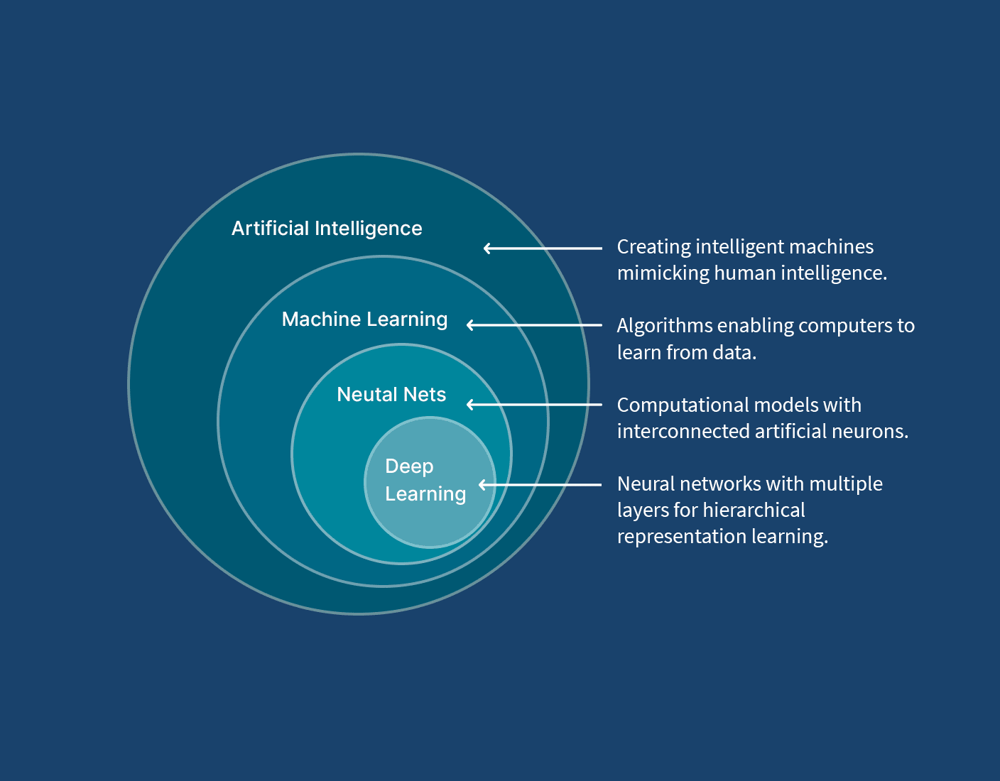

Машинное обучение: от данных к предсказаниям
Введение в область — без формул, только суть

○
Предварительные знания: не требуются. Это первая статья серии, подходит для полных новичков.
Что такое машинное обучение
Традиционная программа работает по жёстким правилам: «если цена упала — продать». Машинное обучение (ML) устроено иначе: вместо того чтобы прописывать правила вручную, мы показываем алгоритму тысячи примеров, и он сам извлекает закономерности.

Представьте, что вы учите ребёнка распознавать кошек. Вы не перечисляете признаки — вы показываете фотографии: «это кошка, это не кошка». Через какое-то время он начинает справляться сам. ML работает по той же логике, только вместо ребёнка — математическая модель, а вместо фотографий — числа.

Ключевая идея: машинное обучение — это не программирование правил, а программирование способности учиться на примерах.

Три типа обучения
Обучение с учителем — алгоритм получает пары «вход → правильный ответ». Например: фотографии с подписями «кот» или «не кот». Задача — научиться предсказывать ответ для новых, невиданных данных.

Обучение без учителя — правильных ответов нет. Алгоритм сам ищет структуру в данных: группирует похожих клиентов, находит аномалии в транзакциях.

Обучение с подкреплением — агент взаимодействует со средой, получает награду за хорошие действия и штраф за плохие. Именно так обучают ИИ, который играет в шахматы или управляет роботом.

Где ML применяется сегодня
Рекомендации в стриминговых сервисах, фильтрация спама, распознавание голоса, перевод текста, медицинская диагностика, прогнозирование спроса — всё это ML-системы. Они не запрограммированы на конкретные ответы: они научились их находить.

Итоги статьи
ML — обучение на примерах, а не кодирование правил
Три основных парадигмы: с учителем, без учителя, с подкреплением
Область применяется во всех отраслях, от медицины до рекомендательных систем